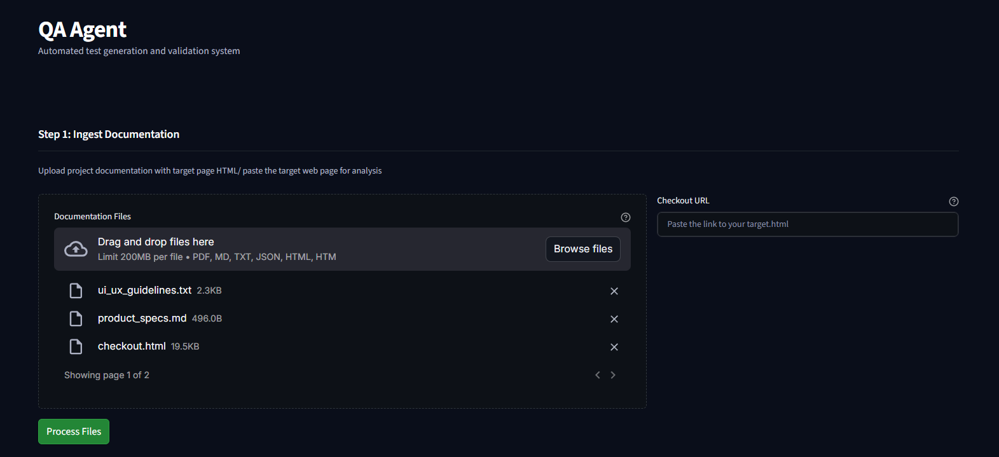
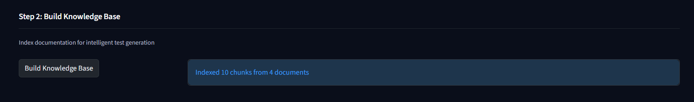
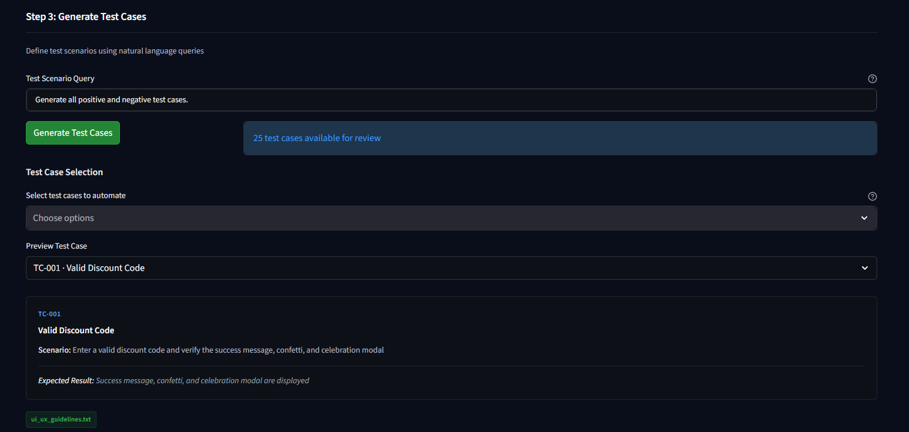
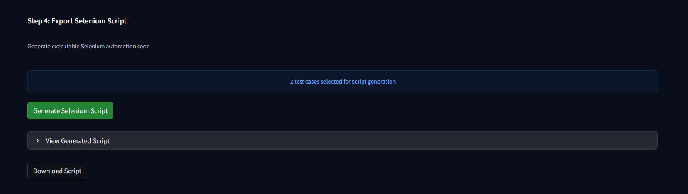
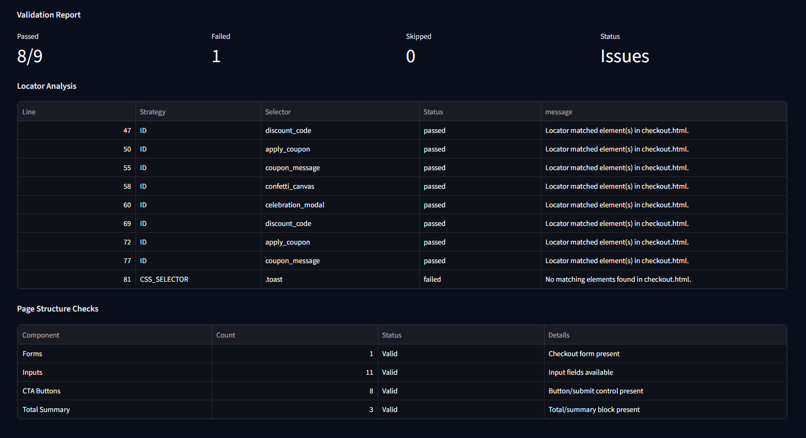

# QA Agent for Test Case & Script Generation

An end-to-end QA assistant that ingests project documentation plus the `target.html` page, builds a grounded knowledge base, generates structured test plans, and turns selected cases into executable Selenium (Python) scripts.

---

## Prerequisites & Setup

| Requirement | Notes |
| --- | --- |
| Python | 3.12 or later (see `pyproject.toml`) |
| Google Chrome + ChromeDriver | Required for Selenium playback; ensure ChromeDriver is on your `PATH`. |
| pip/virtualenv | Recommended for dependency isolation. |

1. **Clone & enter the repo**
	```bash
	git clone <repo-url>
	cd QA_Agent
	```
2. **Create & activate a virtual environment (optional but recommended)**
	```bash
	python -m venv .venv
	# Windows
	.venv\Scripts\activate
	# macOS/Linux
	source .venv/bin/activate
	```
3. **Install dependencies**
	```bash
	pip install -r requirements.txt
	```

Environment variables:
- `API_ENDPOINT` (frontend) – defaults to `http://localhost:8000`; set if the backend is hosted elsewhere.
- `HEADLESS` (backend/Selenium) – defaults to `1` for headless Chrome; set to `0` for visible runs.

---

## Running the Services

### Backend (FastAPI)
```bash
uvicorn backend.app:app --host 0.0.0.0 --port 8000 --reload
```
- Exposes REST endpoints for file ingestion, knowledge-base building, test generation, validation, and Selenium execution.
- Stores uploads and run artifacts under `uploads/`.

### Frontend (Streamlit)
```bash
streamlit run frontend/streamlit_app.py
```
- Provides the five-step workflow UI: ingest files → build KB → generate tests → export script → validate & execute.
- Points to the backend via `API_ENDPOINT` env var (defaults to `http://localhost:8000`).

---

## Usage Examples (with Screenshot/GIF Placeholders)

Each Streamlit step already appears in the UI; use the placeholder references below so future contributors can drop screenshots or GIFs without editing the prose.

### 1. Ingest Documentation
- Upload PDFs/Markdown/TXT/JSON plus the checkout HTML file or URL.
- Backend stores them under `uploads/batch_<id>` and clears prior selections.
- _Screenshot:_ 

### 2. Build Knowledge Base
- Click **Build Knowledge Base** to chunk + embed the docs in ChromaDB.
- Confirmation shows document + chunk counts.
- _Screenshot:_ 

### 3. Generate Test Cases
- Describe desired scenarios (e.g., “Validate checkout with invalid payment method”).
- Review generated cases and multi-select the ones you want.
- _Screenshot:_ 

### 4. Export Selenium Script
- Click **Generate Selenium Script** to synthesize Python code that iterates through the selected cases.
- Expand to preview the script or download `selenium_tests.py`.
- _Screenshot:_ 

### 5. Validate & Execute Automation
- **Validate** runs static locator checks against `checkout.html`.
- **Execute** launches Selenium + ChromeDriver, shows a live feed, and captures MP4/GIF playback.
- _Screenshot:_ 
- _Recording:_ <video src="docs/exec.mp4" controls title="Automation playback"></video>

### CLI-Friendly Quickstart
```bash
# terminal 1 – backend
uvicorn backend.app:app --host 0.0.0.0 --port 8000 --reload

# terminal 2 – frontend
streamlit run frontend/streamlit_app.py

# browser – follow steps 1-5 using the placeholders above
```

> **Tip:** Keep the sample docs (`assets/sample_docs/`) handy so you can always demo the workflow even without proprietary assets.

---

## Included Support Documents

The repository ships with example assets in `assets/sample_docs/` to help you trial the pipeline:

| File | Purpose |
| --- | --- |
| `product_specs.md` | Functional requirements, cart calculations, discount logic. |
| `api_endpoints.json` | REST contract for pricing, promo code validation, inventory. |
| `ui_ux_guidelines.txt` | Visual & interaction standards for the checkout experience. |
| `checkout.html` | Reference checkout page used for locator validation and Selenium playback. |

During ingestion, these documents (or your own uploads) are chunked, embedded, and added to the vector store so LLM prompts remain grounded. The checkout HTML is also cached per batch and passed to Selenium so generated scripts always point at deterministic markup.

---
